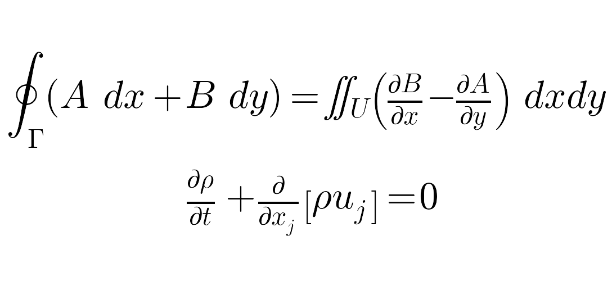

stl_tools
=======================
<!--[](https://travis-ci.org/thearn/stl_tools)-->

Python code to generate STL geometry files from plain text, LaTeX code, and 2D numpy arrays (matrices).

This allows for rapid 3D printing of text, rendered equations, or simple digital images.
Use them for product prototyping, art, cookie cutters, ice cube trays, chocolate molds, (see [this](http://www.makerbot.com/tutorials/making-chocolate-molds/)
to learn how to make a printed object food-safe) or whatever else you can think of.

Some modification may be needed to the STL or printer settings to get certain shapes to print cleanly (i.e. thicker base,
support structures, etc).

Besides printing, these can also be merged into other 3D meshes for many other
possible uses, using programs such as [Blender](http://www.blender.org/).

Also included is a function that can convert raw LaTeX expressions to high
quality .png images, which allows for simple inclusion of LaTeX equations into
non-LaTeX document editors.

 A command-line script for converting images to STL (no text yet) is included in the installation for those who do not
want to write Python code directly.

## Requirements:
- [Python](http://python.org/) 2.7+ or 3.2+
- [Numpy](http://www.numpy.org/) 1.7 or higher (for array manipulation)
- [Scipy](http://www.scipy.org/) 0.12 or higher (for resizing and filtering functions)
- [Matplotlib](http://matplotlib.org/) 1.2.1 or higher (for rendering text and LaTeX to image data)

## Installation:
There are two ways to install `stl_tools`.

It's recommended that you install Numpy, Scipy, and Matplotlib first, either
using binary installers (windows) or using a package manager (`apt-get`,
`homebrew`), etc.

### Installing straight from `PyPI`:
Run `pip install stl_tools`.

### Installing from Source:
Run `python setup.py build install` to install.

Either method will also install the
command line script `image2stl` into the `Python/Scripts` directory.

Automatic tests can be performed by running `stl_tools/test/test_stl.py`.

If a path to a C compiler is found by setuptools, a C-extension will be built to handle most of the computational heavy
lifting needed by the library at runtime. The library can default to using plain python code as well, though this is
much slower.

## Quickstart Examples:

Run the file `examples.py` to produce a few sample STL files from images included in `examples/example_data`.

The first example converts the commonly-used [Lena test image](http://en.wikipedia.org/wiki/Lenna) to an STL file
The "solid" keyword argument sets whether to create a solid geometry (with sides and a bottom) or not.
The algorithm used to generate the sides and bottom have not yet been optimized, so may double the file size
at the moment. We'll generate this example without a bottom.
```python
from stl_tools import numpy2stl

from scipy.misc import lena, imresize
from scipy.ndimage import gaussian_filter


A = imresize(lena(), (256, 256))  # load Lena image, shrink in half
A = gaussian_filter(A, 1)  # smoothing

numpy2stl(A, "examples/Lena.stl", scale=0.1, solid=False)
```

Source image vs. output geometry:


[Click to view STL](examples/Lena.stl)

---

The next two examples convert logos to STL, using color information to achieve appropriate 3D layering.
For this example, we'll generate a solid geometry (solid=True), for comparison to the first example.

Python code:

```python
from pylab import imread

A = 256 * imread("examples/example_data/NASA.png")
A = A[:, :, 2] + 1.0*A[:,:, 0] # Compose RGBA channels to give depth
A = gaussian_filter(A, 1)  # smoothing
numpy2stl(A, "examples/NASA.stl", scale=0.05, mask_val=5., solid=True)
```
Equivalent command-line syntax:
```bash
> image2stl NASA.png -scale 0.05 -mask_val 5. -RGBA_weights 1. 0. 1. 0. -gaussian_filter 1
```


[Click to view STL](examples/NASA.stl)

---

Python code:

```python
A = 256 * imread("examples/example_data/openmdao.png")
A =  A[:, :, 0] + 1.*A[:,:, 3] # Compose some elements from RGBA to give depth
A = gaussian_filter(A, 2)  # smoothing
numpy2stl(A, "examples/OpenMDAO-logo.stl", scale=0.05, mask_val=1., solid=False)
```

Equivalent command-line syntax:
```bash
> image2stl openmdao.png -scale 0.05 -mask_val 1. -RGBA_weights 1. 0. 0. 1. -gaussian_filter 2
```

Source image vs. output geometry:


[Click to view STL](examples/OpenMDAO-logo.stl)

---

Finally, this example renders a LaTeX expression into a png image, then converts this image to an STL.

Note that LaTeX expressions which coincidentally contain special ASCII markers (such as `\n` and `\r`)
have to be escaped with an additional slash in those positions in order to be properly rendered, unless these
markers are intended.

Python code:

```python
from stl_tools import numpy2stl, text2png, text2array

text = ("$\oint_{\Gamma} (A\, dx + B\, dy) = \iint_{U} \left(\\frac{\partial "
        "B}{\partial x} - \\frac{\partial A}{\partial y}\\right)\ dxdy$ \n\n "
        "$\\frac{\partial \\rho}{\partial t} + \\frac{\partial}{\partial x_j}"
        "\left[ \\rho u_j \\right] = 0$")
text2png(text, "examples/Greens-Theorem_Navier-Stokes", fontsize=50) #save png

A = imread("examples/Greens-Theorem_Navier-Stokes.png") # read from rendered png
A = A.mean(axis=2) #grayscale projection
A = gaussian_filter(A.max() - A, 1.)

numpy2stl(A, "examples/Greens-Theorem_Navier-Stokes.stl", scale=0.2,
                                                         mask_val = 5.)
```
Source image vs. output geometry:



[Click to view STL](examples/Greens-Theorem_Navier-Stokes.stl)


## Library usage:
There are 3 principal functions (no classes) to import and use from stl_tools:

### `stl_tools.numpy2stl`
    numpy2stl(A, fn, scale=0.1, mask_val = -np.inf, ascii=False, calc_normals=False)
    Reads a numpy array, and outputs an STL file

    Inputs:
     A (ndarray) -  an 'm' by 'n' 2D numpy array
     fn (string) -  filename to use for STL file

    Optional input:
     scale (float)  -  scales the height (surface) of the
                       resulting STL mesh. Tune to match needs

     mask_val (float) - any element of the inputted array that is less
                        than this value will not be included in the mesh.
                        default renders all vertices (x > -inf for all float x)

     ascii (bool)  -  sets the STL format to ascii or binary (default)

     calc_normals (bool) - sets whether surface normals are calculated or not

     max_width, max_depth, max_height (floats) - maximum size of the stl
                                                object (in mm). Match this to
                                                the dimensions of a 3D printer platform

    Returns: (None)

`numpy2stl()` is the main function of this repository.

It takes a 2D numpy array and output filename
as input, and writes an STL file.

Each element of the array is tessellated to its neighbors to produce 2 triangular faces for
every 4 contiguous elements. The depth axis of any vertex is taken to be the value of the array corresponding to that point.

The `scale` argument scales the height of the resulting geometry. It's a similar effect to extruding or shrinking.

The `mask_val` argument allows you to set a threshold value for elements in the input array for exclusion in the STL file.
Array elements which are less than this value will not be included as vertices.
It takes a bit of trial-and-error to get these just right. Plotting the intermediate arrays
with a colorbar (to show scaling) helps in finding decent values.

The `max_width`, `max_height`, and `max_depth` values are measurements (in mm) used to scale the final output to
the largest size that can fit onto your 3D printer platform. Default values are for the MakerBot Replicator.


### `stl_tools.text2png`
    text2png(text, fn = None)
    Renders inputted text to a png image using matplotlib.

    Inputs:
     text (string) -  text to render

    Optional input:
     fn (string)  -  filename of png to be outputted.
                     defaults to the entered text

    Returns: (None)

`text2png()` was written as an intermediate helper function to render text to pngs, to then be imported, filtered, and meshed.
However, it may be useful in it's own right. For example, it can be used alone to render LaTeX expressions into images, to be imported into WYSIWYG document editors like MS Word or LibreOffice Writer.

### `stl_tools.text2array`
    text2array(text)
    Renders inputted text, and returns array representation.

    Inputs:
     text (string) -  text to render

    Returns: A (ndarray) - 2D numpy array of rendered text


`text2array()` renders inputted text using `text2png()`, but imports the resulting png as an ndarray and deletes the intermediate file.
There may be a direct way to render the matplotlib figure as an array without using an intermediate file, but I could not seem to find a simple
way in the matplotlib docs.

## Command-line scripts

### `image2stl`

`image2stl` is a command-line script that is installed via entry points when `setup.py` is run.
This provides a simple command-line interface to the functions of this library, with the same
arguments. See the examples above for usage.

## Tips:

- Consider scaling down a digital image before generating an STL from its pixels.
For images of standard sizes for modern cameras, the resulting STL file size can be pretty large.

- Just like was shown in the examples, applying a simple filtering function to smooth
sharp edges results in an STL geometry that is likely to be more easily printable. Fine tuning in a
program like Photoshop or Gimp can also help prevent spikes/jagged edges in the geometry.

- To make a proper mold, scale up the edges of the source image to match the maximum pixel value of the image (or higher), to form a lip.
For example:
```python
m, n = A.shape
border_val = 1.1 * A.max()
A[0::m-1, :] = border_val # make top and bottom lip
A[:, 0::n-1] = border_val # make left and right lip
```
In practice, the border may need to be thicker than 1 pixel.

## Known bugs:

- `scipy.misc.imread` has some odd behavior for me on my Linux box (64-bit
Mint 15). When an image is read, an empty 0-dim array is returned. This is
supposedly due to a versioning issue with PIL, which I can't seem to work
around successfully. `pylab.imread` works fine, and seems consistent
across platforms.


## Todo/future features:

- Photos of actual printed models.

- I'm looking into writing a utility function to refine STL meshes by removing redundant vertices (so that wide flat spaces aren't packed with dense tessellations)

- It's possible to apply various warping functions to the resulting
meshes. So you could load an image, warp the result into a cylinder, and have a
textured column (or something like that).

